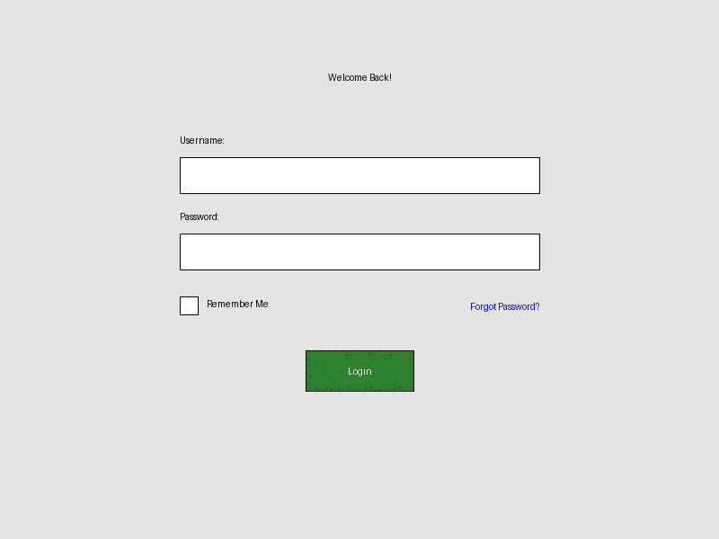

# OmniMCP

[](https://github.com/OpenAdaptAI/OmniMCP/actions/workflows/ci.yml)
[](https://opensource.org/licenses/MIT)
[](https://www.python.org/)
[](https://github.com/astral-sh/ruff)

OmniMCP provides rich UI context and interaction capabilities to AI models through [Model Context Protocol (MCP)](https://github.com/modelcontextprotocol) and [microsoft/OmniParser](https://github.com/microsoft/OmniParser). It focuses on enabling deep understanding of user interfaces through visual analysis, structured planning, and precise interaction execution.

## Core Features

- **Visual Perception:** Understands UI elements using OmniParser.
- **LLM Planning:** Plans next actions based on goal, history, and visual state.
- **Agent Executor:** Orchestrates the perceive-plan-act loop (`omnimcp/agent_executor.py`).
- **Action Execution:** Controls mouse/keyboard via `pynput` (`omnimcp/input.py`).
- **CLI Interface:** Simple entry point (`cli.py`) for running tasks.
- **Auto-Deployment:** Optional OmniParser server deployment to AWS EC2 with auto-shutdown.
- **Debugging:** Generates timestamped visual logs per step.

## Overview

`cli.py` uses `AgentExecutor` to run a perceive-plan-act loop. It captures the screen (`VisualState`), plans using an LLM (`core.plan_action_for_ui`), and executes actions (`InputController`).

### Demos

- **Real Action (Calculator):** `python cli.py` opens Calculator and computes 5*9.
  
- **Synthetic UI (Login):** `python demo_synthetic.py` uses generated images (no real I/O). *(Note: Pending refactor to use AgentExecutor).*
  

## Prerequisites

- Python >=3.10, <3.13
- `uv` installed (`pip install uv`)
- **Linux Runtime Requirement:** Requires an active graphical session (X11/Wayland) for `pynput`. May need system libraries (`libx11-dev`, etc.) - see `pynput` docs.

*(macOS display scaling dependencies are handled automatically during installation).*

### For AWS Deployment Features

Requires AWS credentials in `.env` (see `.env.example`). **Warning:** Creates AWS resources (EC2, Lambda, etc.) incurring costs. Use `python -m omnimcp.omniparser.server stop` to clean up.

```.env
AWS_ACCESS_KEY_ID=YOUR_ACCESS_KEY
AWS_SECRET_ACCESS_KEY=YOUR_SECRET_KEY
ANTHROPIC_API_KEY=YOUR_ANTHROPIC_KEY
# OMNIPARSER_URL=http://... # Optional: Skip auto-deploy
```

## Installation

```bash
git clone [https://github.com/OpenAdaptAI/OmniMCP.git](https://github.com/OpenAdaptAI/OmniMCP.git)
cd OmniMCP
./install.sh # Creates .venv, installs deps incl. test extras
cp .env.example .env
# Edit .env with your keys
# Activate: source .venv/bin/activate (Linux/macOS) or relevant Windows command
```

## Quick Start

Ensure environment is activated and `.env` is configured.

```bash
# Run default goal (Calculator task)
python cli.py

# Run custom goal
python cli.py --goal "Your goal here"

# See options
python cli.py --help
```
Debug outputs are saved in `runs/<timestamp>/`.

**Note on MCP Server:** An experimental MCP server (`OmniMCP` class in `omnimcp/mcp_server.py`) exists but is separate from the primary `cli.py`/`AgentExecutor` workflow.

## Architecture

1.  **CLI** (`cli.py`) - Entry point, setup, starts Executor.
2.  **Agent Executor** (`omnimcp/agent_executor.py`) - Orchestrates loop, manages state/artifacts.
3.  **Visual State Manager** (`omnimcp/visual_state.py`) - Perception (screenshot, calls parser).
4.  **OmniParser Client & Deploy** (`omnimcp/omniparser/`) - Manages OmniParser server communication/deployment.
5.  **LLM Planner** (`omnimcp/core.py`) - Generates action plan.
6.  **Input Controller** (`omnimcp/input.py`) - Executes actions (mouse/keyboard).
7.  **(Optional) MCP Server** (`omnimcp/mcp_server.py`) - Experimental MCP interface.

## Development

### Environment Setup & Checks
```bash
# Setup (if not done): ./install.sh
# Activate env: source .venv/bin/activate (or similar)
# Format/Lint: uv run ruff format . && uv run ruff check . --fix
# Run tests: uv run pytest tests/
```

### Debug Support
Running `python cli.py` saves timestamped runs in `runs/`, including:
* `step_N_state_raw.png`
* `step_N_state_parsed.png` (with element boxes)
* `step_N_action_highlight.png` (with action highlight)
* `final_state.png`

Detailed logs are in `logs/run_YYYY-MM-DD_HH-mm-ss.log` (`LOG_LEVEL=DEBUG` in `.env` recommended).

<details>
<summary>Example Log Snippet (Auto-Deploy + Agent Step)</summary>

```log
# --- Initialization & Auto-Deploy ---
2025-MM-DD HH:MM:SS | INFO     | omnimcp.omniparser.client:... - No server_url provided, attempting discovery/deployment...
2025-MM-DD HH:MM:SS | INFO     | omnimcp.omniparser.server:... - Creating new EC2 instance...
2025-MM-DD HH:MM:SS | SUCCESS  | omnimcp.omniparser.server:... - Instance i-... is running. Public IP: ...
2025-MM-DD HH:MM:SS | INFO     | omnimcp.omniparser.server:... - Setting up auto-shutdown infrastructure...
2025-MM-DD HH:MM:SS | SUCCESS  | omnimcp.omniparser.server:... - Auto-shutdown infrastructure setup completed...
... (SSH connection, Docker setup) ...
2025-MM-DD HH:MM:SS | SUCCESS  | omnimcp.omniparser.client:... - Auto-deployment successful. Server URL: http://...
... (Agent Executor Init) ...

# --- Agent Execution Loop Example Step ---
2025-MM-DD HH:MM:SS | INFO     | omnimcp.agent_executor:run:... - --- Step N/10 ---
2025-MM-DD HH:MM:SS | DEBUG    | omnimcp.agent_executor:run:... - Perceiving current screen state...
2025-MM-DD HH:MM:SS | INFO     | omnimcp.visual_state:update:... - VisualState update complete. Found X elements. Took Y.YYs.
2025-MM-DD HH:MM:SS | INFO     | omnimcp.agent_executor:run:... - Perceived state with X elements.
... (Save artifacts) ...
2025-MM-DD HH:MM:SS | DEBUG    | omnimcp.agent_executor:run:... - Planning next action...
... (LLM Call) ...
2025-MM-DD HH:MM:SS | INFO     | omnimcp.agent_executor:run:... - LLM Plan: Action=..., TargetID=..., GoalComplete=False
2025-MM-DD HH:MM:SS | DEBUG    | omnimcp.agent_executor:run:... - Added to history: Step N: Planned action ...
2025-MM-DD HH:MM:SS | INFO     | omnimcp.agent_executor:run:... - Executing action: ...
2025-MM-DD HH:MM:SS | SUCCESS  | omnimcp.agent_executor:run:... - Action executed successfully.
2025-MM-DD HH:MM:SS | DEBUG    | omnimcp.agent_executor:run:... - Step N duration: Z.ZZs
... (Loop continues or finishes) ...
```
*(Note: Details like timings, counts, IPs, instance IDs, and specific plans will vary)*
</details>

## Roadmap & Limitations

Key limitations & future work areas:

* **Performance:** Reduce OmniParser latency (explore local models, caching, etc.) and optimize state management (avoid full re-parse).
* **Robustness:** Improve LLM planning reliability (prompts, techniques like ReAct), add action verification/error recovery, enhance element targeting.
* **Target API/Architecture:** Evolve towards a higher-level declarative API (e.g., `@omni.publish` style) and potentially integrate loop logic with the experimental MCP Server (`OmniMCP` class).
* **Consistency:** Refactor `demo_synthetic.py` to use `AgentExecutor`.
* **Features:** Expand action space (drag/drop, hover).
* **Testing:** Add E2E tests, broaden cross-platform validation, define evaluation metrics.
* **Research:** Explore fine-tuning, process graphs (RAG), framework integration.

## Project Status

Core loop via `cli.py`/`AgentExecutor` is functional for basic tasks. Performance and robustness need significant improvement. MCP integration is experimental.

## Contributing

1. Fork repository
2. Create feature branch
3. Implement changes & add tests
4. Ensure checks pass (`uv run ruff format .`, `uv run ruff check . --fix`, `uv run pytest tests/`)
5. Submit pull request

## License

MIT License

## Contact

- Issues: [GitHub Issues](https://github.com/OpenAdaptAI/OmniMCP/issues)
- Questions: [Discussions](https://github.com/OpenAdaptAI/OmniMCP/discussions)
- Security: security@openadapt.ai
